# Grand Line 🔳🔳

## Récupération du `user.txt`

> EPI{1f_1_91V3_uP_noW_1M_9o1N9_7O_r39R37_17}

La première étape consiste a scanner les ports ouverts sur la machine cible.

```bash
nmap -sV -sC <target>
```

_- `-sV` : détecte la version des services en cours d'exécution sur les ports ouverts._

_- `-sC` : exécute des scripts de détection par défaut pour obtenir plus d'informations sur les services._

- Résultat :

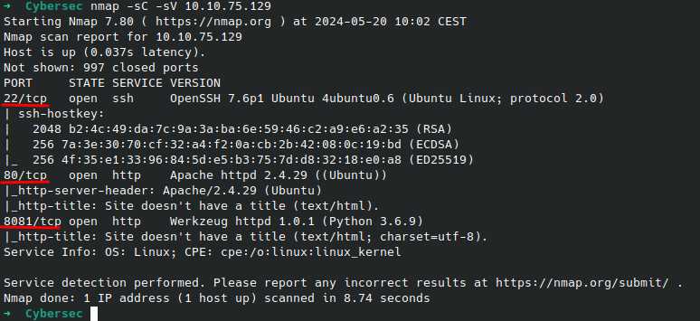

Le scan révèle que les ports suivants sont ouverts :

- **`21/tcp (FTP)`**
- **`80/tcp (HTTP)`**
- **`8081/tcp (HTTP)`**

Après avoir identifié les services actifs sur la machine cible, nous utilisons `gobuster` pour découvrir les répertoires cachés sur le serveur web.

```bash
gobuster dir -w <chemin_de_la_wordlist> -u <target>
```

_- `dir` : mode de `gobuster` pour découvrir des répertoires._

_- `-w <chemin_de_la_wordlist>` : spécifie le chemin vers la liste de mots utilisée pour tester les noms de répertoires._

_- `-u <target>` : URL de la cible._

- Résultat :

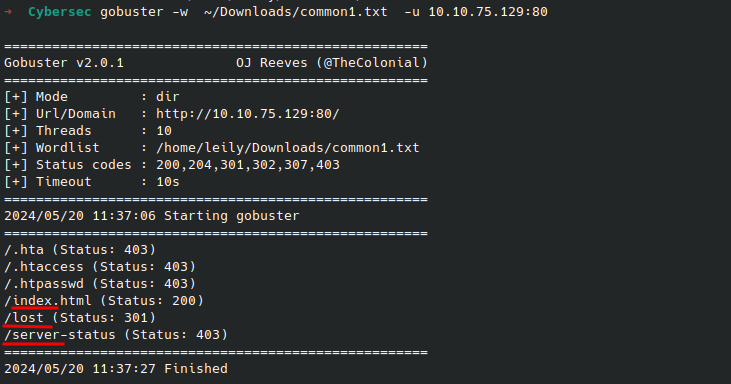

Le scan découvre plusieurs répertoires et fichiers :

- `**/index.html**` : statut 200 (OK)
- `**/lost**` : statut 301 (OK)

En allant sur le répertoire `/lost`, on trouve un fichier `**note.txt**` qui contient des informations utiles.

```url
<target>/lost
```

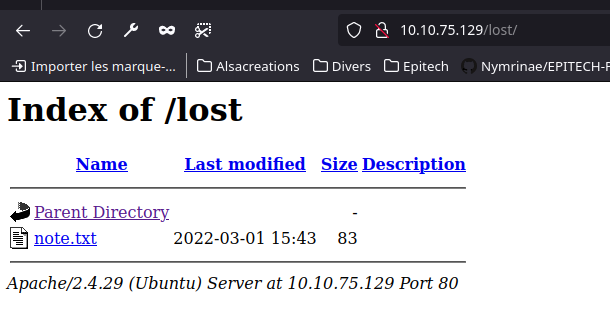

Le fichier `note.txt` contient un message de l'administrateur du serveur.

> You're stubborn, I told you everything is on the other port, have you tried map ?

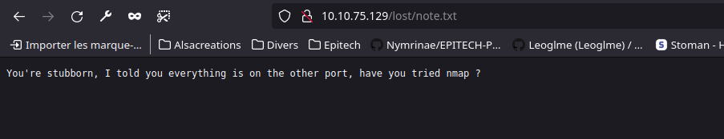

Allons voir du coté du port `8081`.

```url
<target>:8081
```

Le port `8081` héberge une page d'accueil


En explorant le site, on trouve une page de connexion.

```url
<target>:8081/login
```

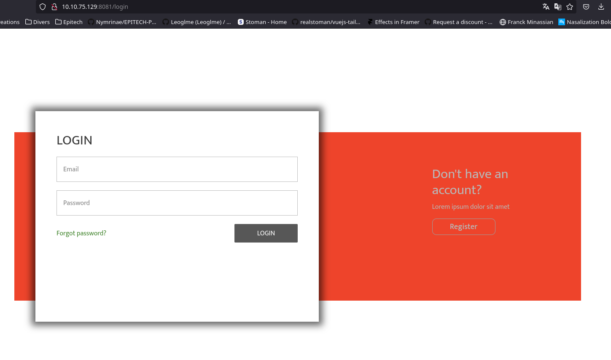

Et une page forgot password.

```url
<target>:8081/forgot
```

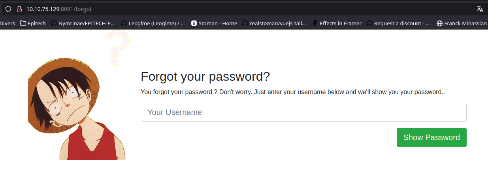

Retournons fouiller du coté du dossier `/lost`. En fouillant sur internet, on s'apercoit que souvent un `/.git` est accessible.
Ont relance Gobuster mais cette fois-ci sur le dossier `/lost`.

Nous décidons donc de regarder de plus près ce que contient ce dossier.
Plusieurs commits sont disponibles. Il va falloir fouiller un peu plus pour trouver des informations intéressantes.

Il faut convertir le fichier en `.gz`

```bash
mv <fichier> <fichier>.gz
```

Nous utilisons `pigz` pour décompresser les fichiers et `cat` pour en faire la lecture.

```bash
pigz -d <fichier>
cat <fichier>
```

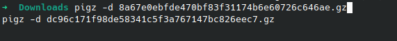
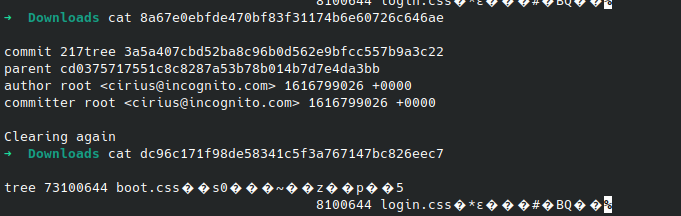

Ont fini par trouver deux commits qui nous interessent avec des informations utiles.

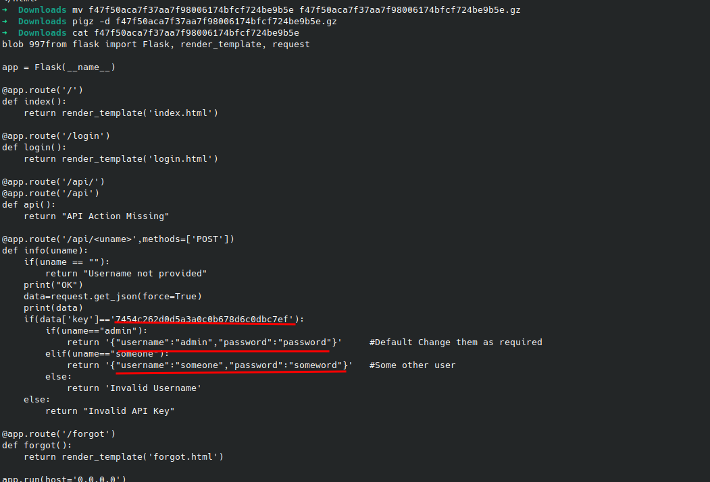
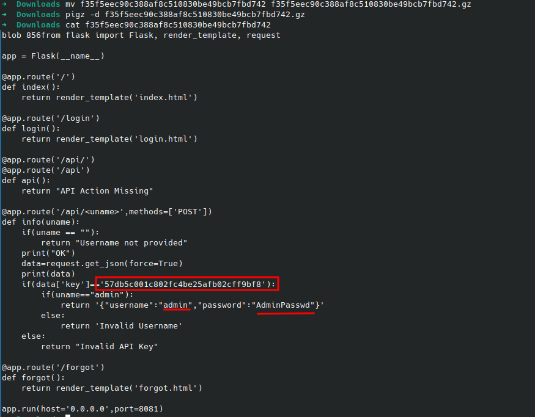

C'est cette clé qui nous permettra de nous connecter au serveur FTP.

> key = 57db5c001c802fc4be25afb02cff9bf8

Allons utiliser postman pour voir ce que nous retourne la clé.

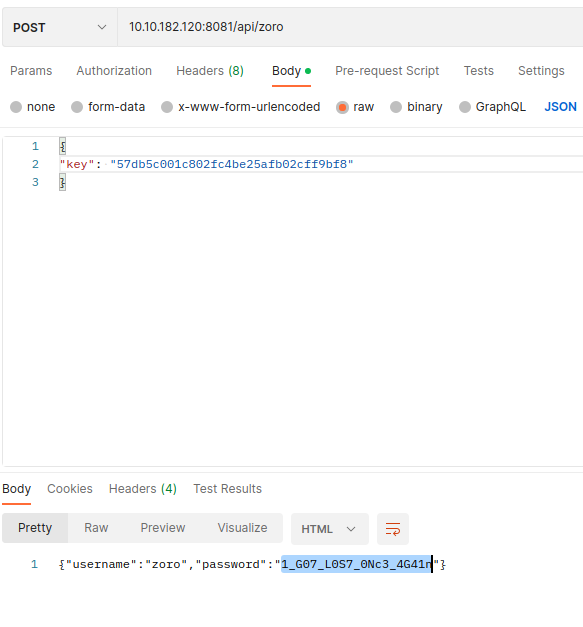

Nous avons donc un token qui nous permettra de nous connecter au serveur FTP de Zoro.

> 1_G07_L0S7_0NC3_4G41n

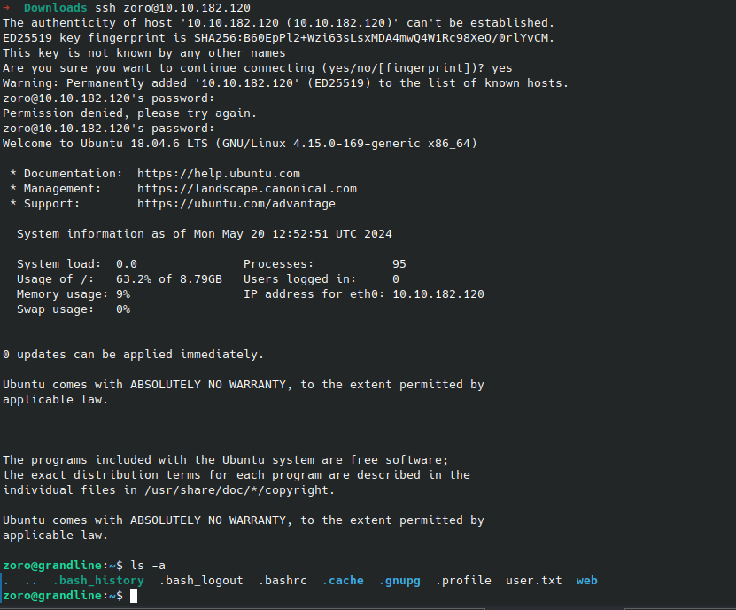

Il n'y a plus qu'a cat le fichier `user.txt` pour obtenir le flag.

```bash
cat user.txt
```

## Récupération du `root.txt`

> EPI{r_W3_Phri3nD2_0R_ph032_7h@\_KInd_0F_7Hin9_J00_D3CiD3_J00R53lv32}

Pour obtenir le flag `root.txt`, nous devons trouver un moyen d'escalader les privilèges.
Connectons-nous au compte de Luffy.

```bash
su luffy
```

Pour son mot de passe, il va falloir faire au plus simple. Tout est dans le titre de l'animé.

> ONEPIECE

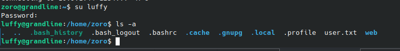

Pour fini ont se donne les droits changer le propriétaire et le groupe des fichiers et répertoires.

```bash
sudo chown -R luffy:luffy /*
```

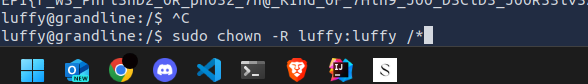

Il ne reste plus qu'a find les fichiers `.txt` pour obtenir le root flag.

```bash
find / -iname *.txt
```

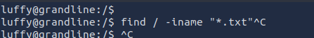

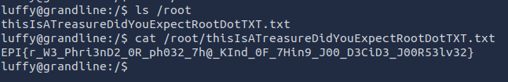

---
